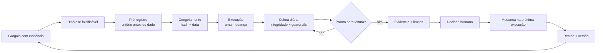

# Método de Experimentos — decisão antes do dado

Um Experimento é uma pergunta de negócio transformada em mudança controlada, evidência comparável e
decisão humana. Ele existe **dentro de um Sistema**.

```text
Cérebro lembra → Sistema opera → Experimento aprende → humano decide
→ Sistema muda → próxima execução começa mais inteligente
```

Não é “mexer e olhar se melhorou”. Não é pedir para a IA escolher um vencedor. Não é um relatório
depois da campanha. A diferença está em definir **antes de ver o resultado** o que muda, o que fica
igual, como medir, quando ler e qual decisão cabe em cada cenário.

> **Critério vem antes do dado. Sem pré-registro, o risco é transformar opinião em gráfico.**

---

## 1. Onde o Experimento mora

| Peça | Responsabilidade |
|---|---|
| **Cérebro** | preserva o histórico, as decisões e a evidência |
| **Sistema** | responde pelo resultado completo |
| **Experimento** | testa uma mudança dentro do Sistema |
| **Eval** | verifica integridade e compara o resultado com a régua |
| **Humano** | interpreta limites, decide e assume a consequência |

Um Sistema pode rodar sem Experimentos quando apenas executa um processo estável. Um Experimento
sem Sistema costuma morrer depois da leitura: o resultado não altera pipeline, skill, configuração
nem próxima execução.

---

## 2. O ciclo completo



O número de análises diárias pode ser alto porque o Sistema verifica continuamente a saúde da
coleta. Isso não autoriza declarar vencedor todo dia. **Ler diariamente protege o experimento;
decidir acontece na regra e na data combinadas.**

---

## 3. Antes de testar: prove que existe um gargalo

Uma ideia interessante não basta. O experimento começa com:

- resultado do Sistema que está abaixo da régua;
- baseline com número, período e fonte;
- explicação do que já foi tentado;
- motivo para acreditar que esta mudança pode mover a métrica;
- dono que tem autoridade para decidir na leitura.

Se não existe baseline, a primeira tarefa é instrumentar. Se não existe resultado-alvo, volte ao
manifest do Sistema. Se a mudança depende de três variáveis ao mesmo tempo, quebre o teste ou aceite
que a causa não poderá ser isolada.

---

## 4. O pré-registro

Preencha antes da mudança entrar no ar:

| Campo | Pergunta |
|---|---|
| **dono da leitura** | quem dá o martelo na data combinada? |
| **gargalo alvo** | qual problema, com qual evidência, estamos atacando? |
| **baseline** | qual número atual, período e fonte? |
| **hipótese** | se mudarmos X, esperamos que Y mova Z — por quê? |
| **mudança única** | o que muda e o que fica explicitamente intocado? |
| **métrica primária** | qual número decide, com janela e regra de contagem? |
| **guardrail** | o que não pode piorar e quanto? |
| **janela de leitura** | quando começa e quando a decisão será tomada? |
| **regra de decisão** | o que fazer em cada resultado possível? |
| **executor** | quem lança, pausa ou corrige a mudança? |

Uma hipótese boa é falsificável:

```text
Se [mudança única], então [métrica] deve [movimento esperado]
porque [mecanismo], mantendo [variáveis importantes] constantes.
```

Ruim: “uma headline melhor vai converter mais”.

Melhor: “se nomearmos o público nos primeiros segundos do anúncio, o custo por lead qualificado
cai, porque a pessoa reconhece mais cedo que a mensagem é para ela; áudio, texto, público e página
permanecem iguais”.

---

## 5. Controle, variação e uma mudança

- **controle:** a versão atual que representa o baseline;
- **variação:** a versão com a mudança testada;
- **mudança única:** a diferença que queremos interpretar.

Se mudamos criativo, público, página e orçamento juntos, podemos medir o pacote, mas não afirmar
qual parte causou o efeito. Isso pode ser uma decisão operacional válida — só não pode ganhar uma
conclusão causal que o desenho não suporta.

---

## 6. Os gates da coleta

O Sistema acompanha diariamente, no mínimo:

1. **instrumentação:** o evento correto está sendo registrado e conciliado;
2. **entrega mínima:** houve volume ou esforço suficiente para uma leitura;
3. **comparabilidade:** controle e variação receberam exposição compatível com o desenho;
4. **janela:** a data combinada terminou;
5. **guardrails:** segurança, custo ou qualidade não cruzaram o limite de parada;
6. **poder de leitura:** a amostra permite a força de conclusão que será declarada.

“Atingiu o gasto mínimo” não significa automaticamente “está estatisticamente provado”. Se o
experimento não teve cálculo de amostra ou poder, a linguagem correta pode ser **evidência
operacional de baixa convicção**, não causalidade demonstrada.

### Parada antecipada

Antes da data, só pare pelo que foi pré-registrado: catástrofe, segurança, falha de
instrumentação, impossibilidade operacional ou limite explícito. Resultado intermediário bonito não
é motivo para antecipar vitória.

---

## 7. Emendas: correção sem reescrever o passado

Depois do congelamento, o pré-registro não é editado. Mudança externa é registrada em uma emenda
numerada, com data, motivo e efeito sobre a leitura.

```text
A1 · fonte de dados ficou indisponível por 6 horas; janela estendida sem mudar a regra.
```

Se a emenda muda métrica, critério ou hipótese **depois de o dado aparecer**, o experimento deve ser
tratado como inconclusivo ou como um novo experimento. Preservar o erro é parte da inteligência.

---

## 8. A leitura separa evidência, limite e decisão

Uma boa leitura tem cinco blocos:

1. **pergunta de negócio** — o que queríamos descobrir;
2. **integridade** — por que a leitura está autorizada;
3. **evidência** — o que os números mostram contra a regra;
4. **limites** — o que NÃO ficou provado;
5. **decisão humana** — manter, corrigir, descartar ou declarar inconclusivo.

Quatro resultados possíveis:

| Decisão | Quando usar |
|---|---|
| **manter** | a regra foi atendida e os guardrails permaneceram válidos |
| **corrigir** | existe sinal útil, mas a próxima rodada precisa de ajuste explícito |
| **descartar** | a regra de perda foi atendida ou o mecanismo perdeu prioridade |
| **inconclusivo** | integridade, volume ou desenho não sustentam a conclusão |

O Sistema apresenta a evidência. **O martelo permanece humano.** A pessoa pode tomar uma decisão
operacional de baixa convicção, desde que a ressalva permaneça no recibo e a comunicação não
transforme sinal em certeza.

---

## 9. O aprendizado só existe quando muda a próxima execução

Depois da decisão, registre qual camada mudou:

- configuração: uma nova preferência ou baseline local;
- pipeline: um estado, retorno ou exceção;
- rotina: um novo gatilho ou cadência;
- skill: um critério de julgamento ou instrução;
- gate: uma proteção determinística;
- eval: uma régua ou caso de teste;
- golden pattern: um exemplo aprovado;
- nenhum: o experimento foi inconclusivo e apenas orienta o próximo teste.

O ciclo fecha quando essa mudança aparece no próximo trabalho e pode ser medida. “Aprendemos que X
funciona” sem alteração versionada é memória oral, não aprendizado do Sistema.

---

## 10. Exemplo real sanitizado

### Pergunta

Nomear o público nos primeiros segundos do anúncio reduziria o custo por lead qualificado em
comparação com o mesmo anúncio sem essa identificação?

### Contrato anterior ao dado

Uma única variável mudaria: a tarja visual. Áudio, texto, público e página permaneceriam iguais.
Também foram congelados métrica principal, guardrail de qualificação, distribuição equilibrada,
entrega mínima, data de leitura e regra para cada resultado.

### Integridade

A janela terminou, as duas versões superaram a entrega mínima, receberam exposição equilibrada e
nenhum guardrail foi violado. Resultados intermediários não foram usados para decidir.

### Evidência e limites

Pela régua pré-registrada, a variação teve custo por lead qualificado **19% menor** na janela. Isso
não provou que a tarja aumentava a qualificação, que o efeito era estatisticamente robusto ou que
toda a diferença havia sido causada pela mensagem. A variação natural entre conjuntos era maior
que o efeito medido.

### Decisão humana

Encerrar como vitória de baixa convicção, adotar a variação, pausar o controle e preservar as
ressalvas.

### Mudança na próxima execução

O call-out entrou como padrão do lote seguinte. Novos testes passaram a exigir janela ou amostra
maiores. O Sistema também ganhou duas correções: nenhum experimento pode gastar sem contrato
operacional ativo; uma variação efetivada como padrão não deve ser confundida com gasto irregular
depois do encerramento.

O valor não é o “19%”. É o encadeamento completo: **pergunta → critério → evidência → limite →
decisão → mudança do Sistema**.

---

## 11. Arquivos e recibos

Um experimento usa um arquivo por ciclo:

```text
meu-sistema/
├── experimento.md              # EXP-001
└── experimentos/
    ├── EXP-002.md
    └── EXP-003.md
```

Cada arquivo preserva:

- pré-registro congelado;
- emendas append-only;
- execução e integridade;
- leitura com fontes;
- decisão assinada;
- mudança na próxima execução.

O lock técnico fica em `.cerebro/sistemas/`, e o recibo do congelamento fica em
`operacao/execucoes/`. Ambos são locais.

---

## 12. Como usar o template executável

Copie [`templates/experimento.md`](templates/experimento.md) para o Sistema instalado:

```bash
cp templates/experimento.md sistemas/outros-instalados/meu-sistema/experimento.md
```

Preencha o pré-registro e congele **antes de lançar a mudança**:

```bash
node scripts/system-experiment.mjs meu-sistema freeze
```

Antes da leitura, verifique a integridade:

```bash
node scripts/system-experiment.mjs meu-sistema verify
```

Para o segundo experimento:

```bash
mkdir -p sistemas/outros-instalados/meu-sistema/experimentos
cp templates/experimento.md sistemas/outros-instalados/meu-sistema/experimentos/EXP-002.md
```

Depois, altere no arquivo `EXP-001` para `EXP-002` e use:

```bash
node scripts/system-experiment.mjs meu-sistema freeze --file=experimentos/EXP-002.md
node scripts/system-experiment.mjs meu-sistema verify --file=experimentos/EXP-002.md
```

O `freeze` recusa campos obrigatórios vazios. O `verify` denuncia edição retroativa da região
selada. Estado operacional, emendas, execução e leitura continuam editáveis porque ficam fora do
hash.

Prompt direto para usar com o agente:

> Leia `METODO-EXPERIMENTOS.md` e use `templates/experimento.md`. Quero testar uma mudança dentro do
> Sistema `<nome>`. Primeiro prove o gargalo com baseline e fonte. Depois proponha hipótese, mudança
> única, métrica, guardrail, janela e regra de decisão. Não lance nada, não congele e não escreva em
> ferramenta externa sem minha aprovação.

---

## 13. Checklist antes de lançar

- [ ] o experimento pertence a um Sistema e a um resultado;
- [ ] há gargalo, baseline, período e fonte;
- [ ] existe uma hipótese falsificável;
- [ ] uma mudança e as variáveis intocadas estão explícitas;
- [ ] métrica, janela e regra de contagem estão definidas;
- [ ] guardrails e parada antecipada estão definidos;
- [ ] data e dono da leitura estão definidos;
- [ ] regra cobre manter, corrigir, descartar e inconclusivo;
- [ ] instrumentação foi validada;
- [ ] pré-registro foi congelado antes da mudança;
- [ ] executor sabe o que pode e o que não pode alterar;
- [ ] a decisão terá um destino no Sistema e na próxima execução.
