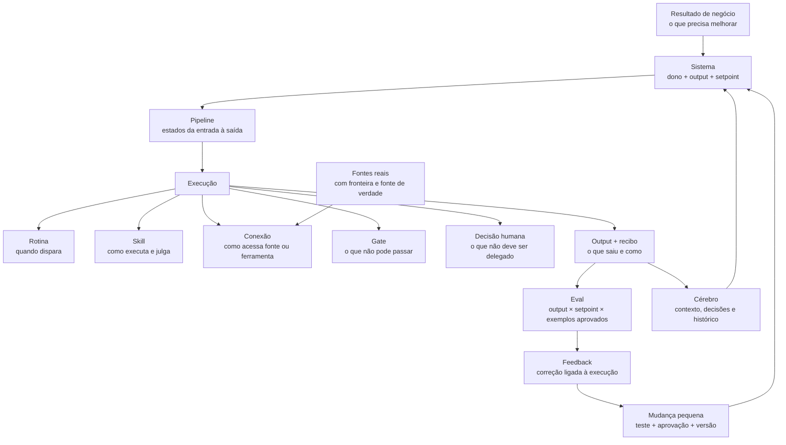

# Método de Sistemas — quando contexto vira resultado

O Cérebro faz a empresa **lembrar**. Um Sistema usa essa memória para **produzir um resultado,
medir o que aconteceu e trabalhar melhor no ciclo seguinte**.

Toda empresa aprende mesmo sem um Cérebro. O problema é onde esse aprendizado fica: na cabeça de
alguém, num chat, numa reunião ou no feeling de quem estava presente. Ele existe, mas não volta de
forma confiável quando outra pessoa ou agente precisa decidir. O Cérebro não inventa aprendizado;
ele o torna persistente, citável e disponível para a próxima execução.

Por isso isto não é um “segundo cérebro” pessoal. É um **Cérebro da Empresa**: memória operacional
para vários resultados, pessoas e agentes. Claude Code, Codex ou outro agente são operadores desse
ambiente. Você pode trocar o operador sem abandonar a memória, a régua e o processo da empresa.

Essa diferença resolve a confusão mais comum:

| Peça | Função |
|---|---|
| **Cérebro** | preserva contexto, evidência, decisões e aprendizado |
| **Sistema** | responde por um resultado completo e recorrente |
| **Pipeline** | define os estados pelos quais a entrada vira saída |
| **Rotina** | decide quando uma parte do pipeline começa ou é revisada |
| **Skill** | carrega o julgamento reutilizável para executar uma tarefa |
| **Conexão** | dá acesso a uma fonte ou ferramenta |
| **Agente** | executa partes autorizadas usando contexto, skills e ferramentas |
| **Experimento** | testa uma mudança dentro do sistema com critério definido antes do dado |
| **Eval** | compara a saída real com a régua |
| **Feedback** | registra a correção que deve mudar a próxima execução |

Um agente não substitui o Cérebro: sem memória, ele começa de novo. Uma skill não substitui o
Sistema: ela sabe fazer uma etapa, não responde pelo resultado inteiro. Um pipeline não substitui o
Sistema: ele descreve o caminho, mas não contém sozinho a régua, o julgamento e o aprendizado.

> **Sistema = resultado + caminho + julgamento + régua + feedback + versão.**

---

## 1. O que é — e o que não é — um Sistema

Um Sistema é um pacote operacional que consegue responder, sem improviso:

1. qual resultado precisa sair;
2. quem responde por ele;
3. que fontes reais alimentam o trabalho;
4. por quais estados a entrada passa;
5. o que a IA pode executar;
6. onde o humano precisa julgar;
7. como sabemos se ficou bom;
8. como uma correção altera a próxima execução.

Não é Sistema:

- uma pasta de prompts;
- um agente com muitas ferramentas;
- uma automação que move dados;
- um dashboard que apenas mostra números;
- um procedimento sem medição;
- uma entrega isolada que precisa ser reconstruída toda vez.

O teste mais curto é: **se o resultado falhar, existe um lugar claro para descobrir onde falhou e
o que deve mudar no próximo ciclo?** Se não existe, ainda há uma execução — não um Sistema.

---

## 2. A arquitetura inteira, do macro ao micro



Há dois ciclos aninhados:

```text
CICLO DO CÉREBRO
capturar → destilar → estruturar → operar → medir

CICLO DO SISTEMA
resultado → pipeline → output → eval → feedback → mudança → nova medição
```

O primeiro impede uma IA genérica. O segundo impede que o contexto vire apenas um acervo bem
organizado.

---

## 3. As oito unidades do contrato

Todo Sistema é descrito pelas mesmas oito unidades. Ferramentas podem mudar; o contrato permanece.

| Unidade | Pergunta que precisa responder | Exemplo |
|---|---|---|
| **Sistema** | qual resultado completo deve sobreviver e melhorar? | reunião vira decisão utilizável |
| **Pipeline** | por quais estados a entrada vira saída? | recebida → extraída → aprovada → salva |
| **Rotina** | que evento ou cadência inicia/revisa o trabalho? | quando a reunião termina |
| **Skill** | qual julgamento reutilizável o agente sabe executar? | extrair decisões com evidência |
| **Conexão** | como o Sistema acessa uma fonte ou ferramenta? | arquivo local, CRM, Drive, API |
| **Gate** | que regra objetiva impede um erro? | nenhuma escrita antes da aprovação |
| **Eval** | como a saída é comparada à régua? | decisão tem dono, prazo e citação |
| **Feedback** | o que deve mudar na próxima execução? | correção ligada ao `run-id` e à versão |

O **output** e o **recibo** atravessam as oito unidades: output é o resultado concreto; recibo é a
prova de como aquela execução terminou.

---

## 4. O contrato do resultado vem antes da arquitetura

Começar por ferramentas produz arquitetura procurando problema. Comece preenchendo cinco campos:

```text
resultado de negócio:
o que NÃO conta como sucesso:
output verificável:
dono do resultado:
setpoint — qual condição torna a saída aceitável:
```

Exemplo:

```text
resultado: reunião deixa decisões e ações utilizáveis
não-sucesso: gerar apenas um resumo bonito
output: decisões, ações, evidências e pendências aprovadas
dono: líder da operação
setpoint: toda decisão tem evidência; toda ação tem dono; o humano confirma que usaria
```

Se o resultado só pode ser descrito como “usar IA”, “organizar dados” ou “automatizar”, ele ainda
não está definido. A pergunta é sempre: **para ganhar o quê, observado como?**

---

## 5. Fontes e fronteiras: o dado não precisa mudar de casa

Um Sistema não começa despejando tudo no Cérebro. Para cada fonte, registre:

| Campo | O que declarar |
|---|---|
| **propósito** | que estado do pipeline essa fonte alimenta |
| **fonte de verdade** | onde o dado continua canônico |
| **acesso** | manual, arquivo local, somente leitura, API ou escrita autorizada |
| **responsável** | quem responde por permissão, qualidade e disponibilidade |
| **frescor** | em tempo real, diário, semanal, mensal ou por evento |
| **fronteira** | o que fica local, o que pode ser derivado e o que nunca pode sair |

Drive pode continuar guardando mídia. CRM pode continuar guardando leads. Banco pode continuar
guardando eventos e PII. O Cérebro guarda **o significado que precisa sobreviver**: decisões,
padrões, critérios, recibos e contexto aprovado.

### Motor compartilhável × configuração privada

Essa separação permite instalar um Sistema em empresas diferentes sem misturar seus dados:

```text
MOTOR COMPARTILHÁVEL
manifest + pipeline + rotinas + skill + evals + changelog

CONFIGURAÇÃO PRIVADA DA EMPRESA
fontes + acessos + vocabulário + responsáveis + fronteiras + feedback + experimentos + recibos
```

O método circula. Os dados não.

O Cérebro INEVITA possui telemetria técnica opcional. Ela pode levar evento, `install_id`, versão,
sistema operacional, runtime e, quando configurados, e-mail de acesso ou `member_id`; execuções de
Sistemas também podem levar IDs opacos, versão, resultado do eval e decisão humana categórica.
**Conteúdo, fontes e outputs não fazem parte desse payload.** Quem quiser operar sem telemetria pode
criar `.cerebro/sem-telemetria` ou usar
`CEREBRO_TELEMETRY=off`; o trabalho continua funcionando.

---

## 6. Pipeline: transforme trabalho em estados observáveis

Pipeline não é uma lista de tarefas. Cada linha precisa declarar quatro coisas:

| Estado | Entrada | Saída | Gate |
|---|---|---|---|
| recebida | fonte real | fonte identificada | existe acesso autorizado |
| transformada | fonte | output candidato | afirmações apontam evidência |
| revisada | candidato | correções do dono | julgamento humano registrado |
| aprovada | revisada | output aceito | definição de pronto atendida |
| medida | output | resultado do eval | janela e fonte válidas |
| encerrada | resultado | recibo + feedback | próxima ação explícita |

Um pipeline bom também declara:

- como um estado avança;
- quando volta para correção;
- quando para e escala;
- quem decide a exceção;
- qual identificador liga a execução ao output e ao feedback.

---

## 7. Rotina, skill, conexão, gate e decisão humana

Essas peças convivem no pipeline, mas não são sinônimos.

### Rotina — quando

Dispara por evento ou cadência: “quando a call termina”, “todo dia às 9h”, “quando a amostra
atinge o mínimo”. Uma rotina declara gatilho, dono, entrada, passos, exceção e recibo.

### Skill — como

Carrega know-how executável para uma tarefa: tratar call, revisar copy, montar briefing, ler um
experimento. Declara entrada, saída, regras, exemplos aprovados e quando escalar.

### Conexão — acesso

É uma interface fina: arquivo local, CLI, MCP ou API. Conectar uma ferramenta não cria o Sistema;
apenas torna uma capacidade acessível.

### Gate — proteção

É uma regra objetiva que barra o avanço: fonte ausente, PII exposta, versão incompatível,
instrumentação quebrada, ausência de aprovação. Regra inviolável vira código sempre que possível.

### Decisão humana — autoridade

Promessa, prioridade, gosto, publicação, gasto material, consentimento, fronteira de dados e mudança
do motor permanecem com uma pessoa nomeada. A IA organiza evidência e opções; o humano dá o
martelo.

---

## 8. A régua: sensor, métrica, setpoint, eval e exemplos aprovados

| Peça | Pergunta |
|---|---|
| **Sensor** | que sinal real conseguimos observar? |
| **Métrica** | que número ou estado descreve o resultado? |
| **Setpoint** | qual faixa ou condição é aceitável? |
| **Eval** | como comparamos a saída real com a régua? |
| **Golden pattern** | qual exemplo humano aprovado mostra “é assim que bom se parece”? |
| **Golden set** | quais casos bons, ruins e de limite testam uma mudança? |

O eval pode combinar duas camadas:

1. **gates determinísticos:** formato, campos, segurança, proveniência, integridade;
2. **julgamento humano:** utilidade, gosto, prioridade, adequação e decisão material.

Um output pode estar tecnicamente correto e ser inútil. Por isso “o script passou” não é sinônimo
de “o Sistema gerou valor”.

---

## 9. Feedback que realmente melhora a próxima execução

Feedback útil não é “ficou ruim”. Ele liga cinco coisas:

```text
execução + versão + output + correção humana + efeito esperado na próxima execução
```

Uma correção isolada vira aprendizado local. Quando há padrão comparável, ela pode virar uma
mudança pequena em uma destas camadas:

- configuração da empresa;
- pipeline;
- rotina;
- skill;
- gate;
- eval;
- golden set.

O loop seguro é:

```text
feedback → menor mudança possível → replay em casos anteriores
→ comparação → aprovação humana → nova versão → nova medição
```

Isso é **Self Improvement**. Não é uma IA reescrevendo o próprio motor em silêncio.

---

## 10. Onde entra o Experimento

Sistema pode existir sem experimento: um processo estável ainda precisa operar e medir. Experimento
entra quando existe uma incerteza relevante e queremos alterar uma parte do Sistema.

```text
Sistema detecta gargalo
→ Experimento pré-registra uma mudança
→ execução coleta evidência
→ humano decide
→ decisão altera ou preserva o Sistema
```

Experimento órfão termina em gráfico. Experimento ligado a Sistema muda configuração, skill,
pipeline, régua ou próxima execução. O protocolo completo está em
[`METODO-EXPERIMENTOS.md`](METODO-EXPERIMENTOS.md).

---

## 11. Como construir a primeira versão

### Passo 1 — escolha um resultado

Escolha algo recorrente que encoste em **decisão, venda ou entrega**. Um Sistema por vez.

### Passo 2 — descreva o estado atual com evidência

Use uma execução real recente. Identifique fonte, output atual, falhas e quem hoje compensa o
processo na mão.

### Passo 3 — congele o contrato mínimo

Preencha resultado, não-sucesso, output, dono e setpoint no `manifest.md`.

### Passo 4 — desenhe o pipeline real

Modele o que acontece hoje, inclusive retornos e exceções. Não desenhe a operação ideal como se já
existisse.

### Passo 5 — encaixe as oito unidades

Nomeie rotina, skill, conexão, gates, eval e feedback. Lacuna explícita é melhor que automação
inventada.

### Passo 6 — rode manualmente ponta a ponta

O humano pode ser o algoritmo da primeira versão. O objetivo é provar o contrato, não maximizar
automação.

### Passo 7 — deixe recibo

Registre entrada, saída, versão, gates, decisão humana, falhas e próxima ação.

### Passo 8 — repita antes de sofisticar

Três execuções comparáveis revelam onde existe padrão. Só então automatize o trecho estável ou
promova uma mudança no motor.

---

## 12. Maturidade do Sistema

| Estado | O que é verdade |
|---|---|
| **instalado** | o pacote existe, mas ainda não provou valor no contexto local |
| **beta** | roda ponta a ponta e acumula casos e correções |
| **validado** | repetiu o resultado com a régua em casos reais |
| **publicado** | pode ser distribuído com versão, instrução e rollback |

Instalação não é ativação. Automação não é validação. Volume não substitui comparação com a régua.

---

## 13. Checklist de saída

- [ ] resultado e não-sucesso definidos;
- [ ] dono humano e autoridade de decisão;
- [ ] output verificável;
- [ ] fontes de verdade, acessos e fronteiras;
- [ ] pipeline com estados, retornos e exceções;
- [ ] rotinas com gatilho, dono e recibo;
- [ ] skills com entrada, saída, regras e exemplos;
- [ ] conexões substituíveis;
- [ ] gates determinísticos;
- [ ] setpoint e eval;
- [ ] golden pattern e golden set inicial;
- [ ] feedback ligado a execução e versão;
- [ ] recibo do primeiro ciclo;
- [ ] mudança pequena, aprovação e rollback;
- [ ] próximo gate de maturidade.

---

## 14. Comece pelo template

Copie [`templates/sistema/`](templates/sistema/) para uma nova pasta e preencha nesta ordem:

1. `manifest.md` — o contrato do resultado;
2. `configuracao.md` — o contexto privado da empresa;
3. `pipeline.md` — os estados;
4. `rotinas.md` — os gatilhos;
5. `skill-contract.md` — o julgamento executável;
6. `evals.md` — a régua;
7. `feedback.md` — as correções locais;
8. `changelog.md` — as versões do motor.

Prompt direto para usar com o agente:

> Leia `METODO-SISTEMAS.md`. Quero transformar uma operação real em Sistema. Não invente meu
> processo. Comece pelo resultado, pelo que não seria sucesso, pelo output verificável e por uma
> execução recente. Depois proponha o contrato das oito unidades usando `templates/sistema/`.
> Mostre as lacunas e peça minha aprovação antes de gravar.

---

## 15. O que é aberto e o que a Society acrescenta

O Cérebro aberto entrega o método, o Architect, os templates em branco e o motor que protege o
pré-registro. Isso permite entender a arquitetura e construir a primeira versão com os próprios
dados.

A INEVITA Society não vende um PDF escondido. Ela acrescenta o que não nasce de um template:

- System Packs com skill, configuração e evals já empacotados;
- julgamento e golden patterns produzidos por operadores;
- laboratórios em operações reais;
- casos, correções e limites que já apareceram em campo;
- releases versionados que descem para o Cérebro do membro;
- instalação acompanhada e comparação entre ciclos.

**O método circula. Os dados permanecem privados. A capacidade validada pela rede compõe sobre os
dois.**
